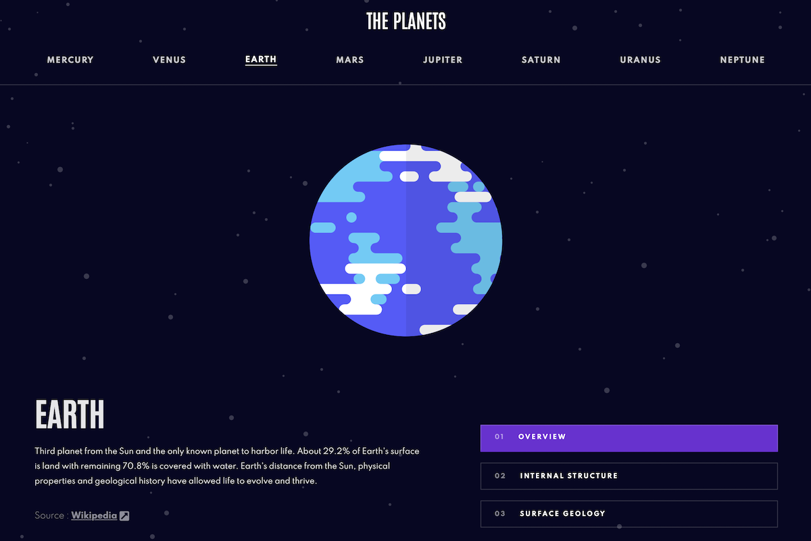

# Planetary Facts

## Table of contents
- [Overview](#overview)
- [My process](#my-process)
  - [Built with](#built-with)
  - [Application Structure](#application-structure)
- [Acknowledgements](Acknowledgements)
- [Author](#author)

## Overview

A mobile first, fully responsive React application that provides information pertaining to the planets of the Solar System. Each planet page features key information at the bottom and three separate tabs that include additional information/images. 

[Live Demo](https://planetary-factz.netlify.app/Earth)

## My process
### Built with

- HTML5 / CSS3
- React
- React Router
- Font Awesome (React)

### Application Structure 

The application features a main App component and two custom components (Nav + Planet). Routing logic is established within the App component; routes are dynamically defined and are based on the active planet which is stored as state. 

The Navigation component manages linking to each page, and it also handles the active state of the animated hamburger button for small viewports. The Planet component receives data as a prop from the App component and uses it to render the bulk of the application.

## Acknowledgements

Special thanks to:
  * Front End Mentor for providing the design assets (figma file + images) and planet data.

## Author

- Jacob Stewart
- Website - [https://jacobstewart.dev/](https://jacobstewart.dev/)
